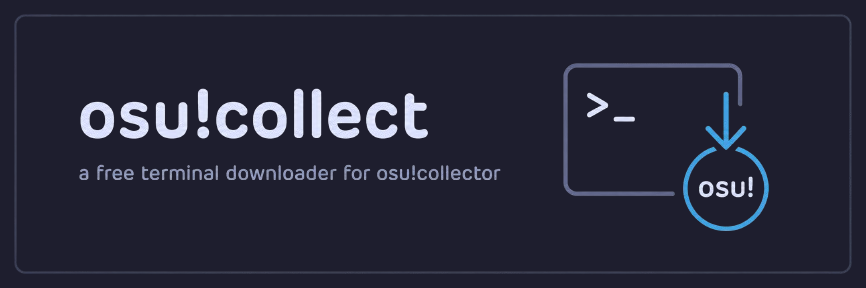
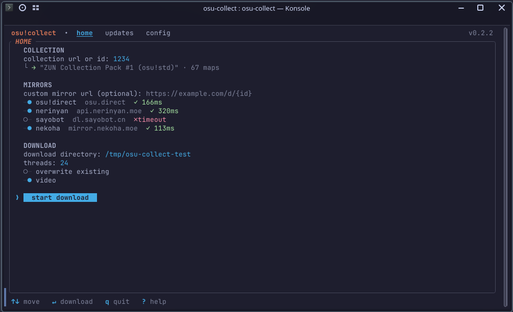
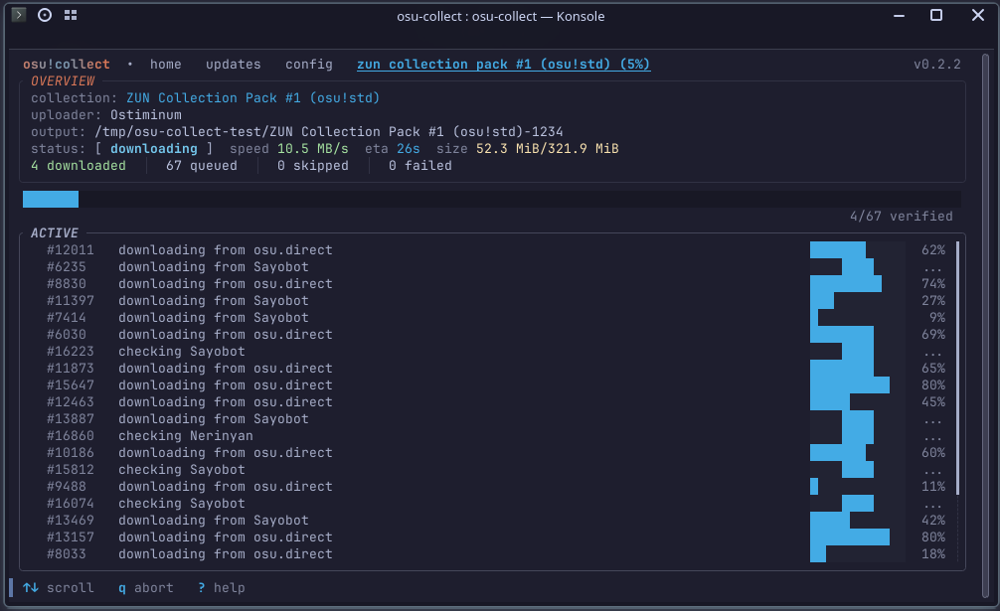
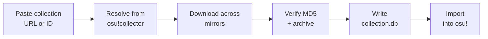

<div align="center">



<h1></h1>

<p style="font-size: 22px" ><b>Free osu!collector downloader in your terminal</b></p>

[](https://github.com/uwuclxdy/osu-collect/actions/workflows/release.yml)
[](https://github.com/uwuclxdy/osu-collect/releases/latest)
[](https://github.com/uwuclxdy/osu-collect/releases)


[Features](#features) · [Install](#installation) · [Usage](#usage) · [Import](#importing-into-osu) · [Configuration](#configuration) · [FAQ](#faq)

</div>

osu!collect is a terminal app (TUI) that **downloads osu! beatmap collections from [osu!collector](https://osucollector.com)**. Paste a collection link, pick a folder, and it batch-downloads every map across multiple mirrors, generates a ready-to-import `collection.db`, and can re-check the collection later to grab only the maps you're missing.

<div align="center">




</div>

## Features

- **Batch downloads** from any osu!collector collection. Paste a URL or ID, press enter.
- **Mirrors with automatic failover**: osu!direct, Nerinyan, Sayobot, Nekoha, Beatconnect, osu!dl, the Hinamizawa cascade, your own custom mirrors, plus the official osu! servers once you log in.
- **Rate-limit aware**: throttled mirrors sit out while the rest keep downloading, with per-map cooldown countdowns in the UI. Each map starts on a different mirror (round-robin) and requests to any one mirror are spaced out, so load spreads instead of hammering a single host.
- **Collections updater**: Re-check a collection later and download only the maps that are missing or newly added.
- **Ez import with `collection.db`**: Maps arrive as a proper osu! collection, not a loose folder of `.osz` files.
- **Integrity verification**: MD5 plus archive validation on every download; files already on disk are verified and skipped.
- **Skips what you already own**: Reads your osu! library (stable `osu!.db` / lazer realm) and skips maps you've already imported instead of re-fetching them; they still go into the generated `collection.db`.
- **Retry failed maps**: Failures persist between runs. Retry them with one key, or on the next download.
- **Parallel collection tabs**: Queue several collections and download them at once.

## Installation

### One-line install (recommended)

**Linux x64 / macOS Apple Silicon**:

```bash
curl -fsSL https://raw.githubusercontent.com/uwuclxdy/osu-collect/main/install.sh | bash
```

**Windows x64 (PowerShell)**:

```powershell
iwr https://raw.githubusercontent.com/uwuclxdy/osu-collect/main/install.bat -OutFile "$env:TEMP\osu-install.bat"; & "$env:TEMP\osu-install.bat"
```

This installs to `%LOCALAPPDATA%\Programs\osu-collect`, adds it to your `PATH`, creates shortcut 
on desktop and registers itself in **Settings → Apps → Installed apps**. No admin needed.

### Prebuilt binary

Download from [Releases](https://github.com/uwuclxdy/osu-collect/releases/latest) and run it in terminal.

> [!NOTE]
> osu!collect runs in a terminal. Windows users should be able to open it with a double click as well,
> but it's not guaranteed. Open an [Issue](https://github.com/uwuclxdy/osu-collect/issues/new/choose) if it doesn't work.
> Windows Terminal or PowerShell 7+ are recommended.

### Install latest from source (Rust 1.85+)

```bash
cargo install --git https://github.com/uwuclxdy/osu-collect
```

## Uninstall

**Windows**: Settings → Apps → Installed apps → **osu!collect** → Uninstall. 

**Linux/macOS**: run `rm ~/.local/bin/osu-collect`.

## Usage

```bash
osu-collect
```

Paste a collection link, pick a directory, press <kbd>↵</kbd>.

| Field | What it does |
|---|---|
| **Collection URL or ID** | Accepts `https://osucollector.com/collections/{id}` or a bare ID. Resolves as you type and remembers recent collections. *Required.* |
| **Download directory** | Defaults to the last used folder. <kbd>tab</kbd> completes filesystem paths. |
| **Threads** | Parallel downloads. Defaults to your CPU core count; 20 or fewer avoids rate limiting. |
| **Custom mirror URLs** | Add as many as you want — each must include the `{id}` placeholder. A new empty row appears as you type; clearing a row removes it. Tried after the built-in mirror toggles. |
| **Skip existing** | Verifies and skips maps already on disk. |
| **Overwrite existing** | Skips the on-disk recheck and redownloads every map fresh. |
| **Video** | Includes beatmap videos (on by default); off downloads video-free where the mirror supports it. |

### Controls

| Keys | Action |
|---|---|
| <kbd>↑</kbd> <kbd>↓</kbd> | Move between rows |
| <kbd>←</kbd> <kbd>→</kbd> <kbd>tab</kbd> <kbd>shift</kbd>+<kbd>tab</kbd> | Switch tabs (<kbd>tab</kbd> path-completes the directory while editing it) |
| <kbd>↵</kbd> | Activate, toggle, start a download, or edit a field |
| <kbd>space</kbd> | Toggle the focused checkbox or switch |
| <kbd>s</kbd> | Jump to the download button; on a download tab, skip maps stuck on a rate-limit cooldown |
| <kbd>+</kbd> <kbd>-</kbd> | Adjust thread count |
| <kbd>r</kbd> | Retry all failed maps on a download tab |
| <kbd>x</kbd> | Dismiss an error message |
| <kbd>?</kbd> | Help overlay listing every key |
| <kbd>q</kbd> | Back / quit (press twice to confirm; aborts a running download the same way) |
| <kbd>ctrl</kbd>+<kbd>c</kbd> | Quit immediately from anywhere |
| <kbd>home</kbd> <kbd>end</kbd> | Jump to the first / last row of a list or form |
| <kbd>pgup</kbd> <kbd>pgdn</kbd> | Page a list up / down |

Text fields support full caret editing: <kbd>home</kbd>, <kbd>end</kbd>, <kbd>delete</kbd>, and <kbd>ctrl</kbd>+<kbd>w</kbd> to delete the previous word.

**Vim keys** (off by default, toggle on the config tab): <kbd>h</kbd> <kbd>j</kbd> <kbd>k</kbd> <kbd>l</kbd> move, <kbd>g</kbd><kbd>g</kbd> / <kbd>G</kbd> jump to top / bottom, <kbd>ctrl</kbd>+<kbd>u</kbd> / <kbd>ctrl</kbd>+<kbd>d</kbd> page, and <kbd>i</kbd> / <kbd>a</kbd> start editing the focused field. A field in edit mode types literally; <kbd>esc</kbd> leaves it. When enabled, a <kbd>vim</kbd> marker shows in the footer.

### Download tabs

Each queued collection gets its own tab with live per-map progress, speed and ETA, rate-limit countdowns, and a failure summary with reasons. Failed maps persist between runs. Retry them with <kbd>r</kbd>, or accept the prompt on your next download of that collection (configurable).

### Updates tab

Tracks every collection you've downloaded, re-checks them against osu!collector, and shows what's missing or was removed. Pick exactly which maps to fetch, so keeping a collection current never means redownloading it. If a map you already own keeps showing as missing, mark it installed with <kbd>i</kbd> (or <kbd>I</kbd> for every shown map) to hide it; a later scan that actually finds it on disk un-hides it automatically. Your osu! install path and client choice now persist across restarts.

### Logging in with your osu! account (optional)

The config tab's login chip opens a dedicated **login tab** where you enter your osu! username and password (masked). This signs in through osu!lazer's first-party client, which is the only way to unlock the **osu! official** download mirror. If osu! needs to verify a new device, the tab prompts for the emailed code. Your password is sent only to `osu.ppy.sh` and never stored — only the resulting token lives in `auth.json` (local).

> Heads up: this uses osu!lazer's first-party login, an unofficial grey area. The official mirror is rate-limited (~10–20 downloads/hour) and stays **off by default** — keep it as a last-resort source and use it sparingly. Requests to osu! are throttled automatically (about one per second, shared across all download threads) to stay within its general API rate; the hourly download cap still applies and shows up as a temporary rate-limit when reached.

## How it works



## Importing into osu!

<details open>
<summary><b>osu! lazer</b></summary>

1. Import all downloaded maps into lazer.
2. Click `Run first time setup`, then `Next` until the **Import screen**.
3. Set `previous osu! install` to the **folder of the collection** you downloaded.
4. Click `Import content from previous version`.
5. Done. Both the maps and the collection are imported.

</details>

<details>
<summary><b>osu! stable</b></summary>

Drag the downloaded `.osz` files into osu!, then merge the generated `collection.db` with a tool like [Collection Manager](https://github.com/Piotrekol/CollectionManager). If you have no existing collections, back up your own `collection.db` and swap in the generated one.

</details>

## Configuration

osu!collect reads an optional config file with defaults for mirrors, threads, archive validation, retry policy, theme, and logging:

| OS | Path |
|---|---|
| Linux / macOS | `~/.config/osu-collect/config.toml` |
| Windows | `%APPDATA%\osu-collect\config.toml` |

Every key is documented in [config.toml.example](config.toml.example). Most settings are also editable live on the config tab, where changes apply and save immediately.

## Alternatives

| Tool | How osu!collect differs |
|---|---|
| [osu!Collector desktop client](https://osucollector.com/app) | The official app. Bulk download needs a paid subscription; osu!collect is free. |
| [BatchBeatmapDownloader](https://github.com/nzbasic/batch-beatmap-downloader) | Downloads by filters and criteria rather than osu!collector collections. The original inspiration for this project. |
| [osu-collector-dl](https://github.com/roogue/osu-collector-dl) | A CLI script with no TUI, no `collection.db` generation, and no updater. |
| [OsuCollectionDownloader](https://github.com/waylaa/OsuCollectionDownloader) | Generates `.osdb` files and needs the .NET runtime. |
| [Collection Manager](https://github.com/Piotrekol/CollectionManager) | Manages and merges existing collections; pairs well with osu!collect for stable imports. |

## FAQ

**How do I download an osu!collector collection for free?**
Run osu!collect, paste the collection URL, press <kbd>↵</kbd>. Downloads come from public beatmap mirrors, or the official servers if you log in. No subscription needed.

**Does it work with osu! lazer?**
Yes. See [Importing into osu!](#importing-into-osu). The generated `collection.db` imports through lazer's first-time-setup flow.

**Do I need an osu! account?**
No. Logging in is optional and only adds the official osu! servers as an extra source.

**Can it update a collection I downloaded earlier?**
Yes. The updates tab diffs your downloaded collections against osu!collector and fetches only what's missing.

**A download failed or got rate limited. What now?**
Failures save per collection. Press <kbd>r</kbd> on the download tab to retry them all, or accept the retry prompt next time you download that collection. Rate-limited mirrors cool down on their own while the others keep going. A map that stays throttled past the auto-skip delay (60s by default, configurable) is skipped on its own so the run never stalls; press <kbd>s</kbd> any time to skip the currently-stuck maps yourself without waiting.

## Building from source

```bash
cargo build --release
```

<details>
<summary><b>Windows cross-builds and requirements</b></summary>

Requires Rust 1.85+ (edition 2024). For Windows cross-builds, `build.sh` produces Linux and Windows binaries in `build/`.

</details>

## Roadmap

- [ ] All features of [BatchBeatmapDownloader](https://github.com/nzbasic/batch-beatmap-downloader) (🚧 in the works)

## Acknowledgments

Powered by [osu-downloader](osu-downloader/) (the bundled Rust library handling mirrors, failover, validation, and events), [osu-db](https://crates.io/crates/osu-db), and [ratatui](https://ratatui.rs). Inspired by [BatchBeatmapDownloader](https://github.com/nzbasic/batch-beatmap-downloader).

## License

MIT. See [LICENSE](LICENSE).
