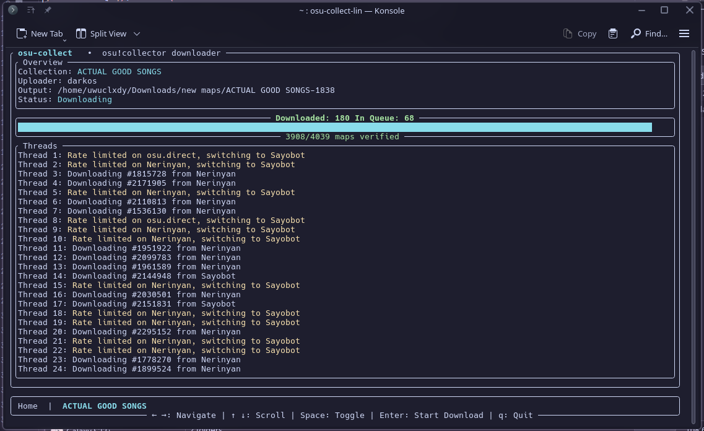
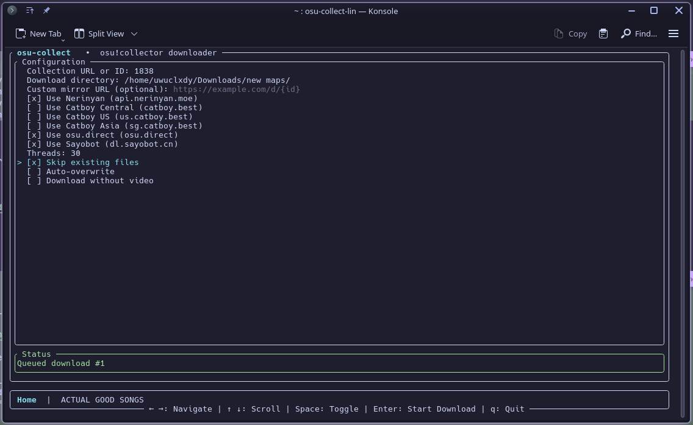

# osu!collect
[](https://github.com/uwuclxdy/osu-collect/actions/workflows/release.yml)

A TUI program to download osu! beatmap collections from [osu!collector](https://osucollector.com) for free :3

> [!NOTE]
> This is a TUI (Terminal User Interface) program, so make sure to run it in terminal / command prompt.

> [!TIP]
> Catboy mirrors (Central / US / Asia) tend to rate limit quickly, so keep at least one other mirror enabled.




## Installation

Download the binary for your platform from the latest CI run on [releases page](https://github.com/uwuclxdy/osu-collect/releases).

Or compile and install from source:
```bash
git clone https://github.com/uwuclxdy/osu-collect
cd osu-collect
cargo install --path .
```

## Usage

> **Note for Windows Users:** Windows Terminal or PowerShell 7+ are recommended

### Running the TUI

Run `osu-collect` in your terminal to launch the program. Configure, then press `Enter` to queue a download.

- `Collection URL or ID`: accepts `https://osucollector.com/collections/{id}` links or just the collection ID. *Required*
- `Download directory`: defaults to the current working directory.
- `Threads`: number of threads to spawn per collection (default 3, max 50). Automatically set to `download.concurrent` from the config when set.
- `Custom mirror URL`: must include `{id}` placeholder; combines with the built-in mirror toggles below it.
- `Skip existing` verifies and skips previously downloaded maps.
- `Auto-overwrite` forces redownloads of all maps.
- `No Video` downloads maps without video when available.

#### Controls
- `Tab` / `Shift+Tab` or `Up` / `Down` move between fields.
- `Space` toggles checkboxes when focused.
- `Enter` starts download.
- `Left` / `Right` switches between the tabs.
- `q` / `Esc` on the home tab prompts to quit; press it again to confirm. On a download tab it cancels that download.
- `Ctrl+C` aborts every running download immediately and exits.

#### Download tabs
Each queued collection opens in its own tab, meaning you can have multiple collections downloading simultaneously. There are only some basic statistics available for now.

### ‼️ IMPORTANT: importing to osu! lazer

After downloading, **follow the steps below** to correctly **import collection**:
1. Import all downloaded maps into lazer
2. Click `Run first time setup` and `Next` until the **Import screen**
3. Set `previous osu! install` to the **directory of the collection** you've downloaded
4. Click `Import content from previous version`
5. That's it, you can close the setup screen, and the collection should be imported!

## Configuration

You can create a configuration file to set default options:

### Linux/macOS
`~/.config/osu-collect/config.toml`

### Windows
`%APPDATA%\osu-collect\config.toml`

> Look at config.toml.example for a configuration example and available options

## Building from Source & Contributing

### Prerequisites
- Rust 1.70 or later
- For Windows: MSVC or MinGW-w64 toolchain

#### Install Windows Target (MinGW)
```bash
rustup target add x86_64-pc-windows-gnu
cargo build --release --target x86_64-pc-windows-gnu
```

#### Cross-compilation
The included `build.sh` script can build for both Linux and Windows:
```bash
./build.sh
```

Outputs will be in the `build/` directory.

## TODO
- [ ] Make this a complete cross-platform replacement for BatchBeatmapDownloader
- [ ] Collection updater tab
- [ ] Make it look more visually appealing
- [ ] official mirror (+ login)
- [ ] Many other things I can't think of..
